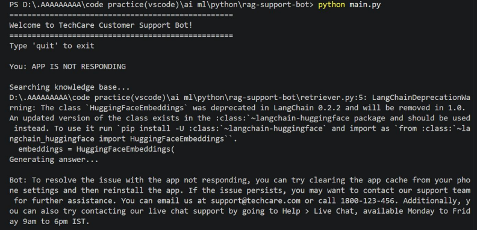
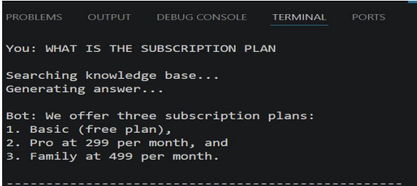
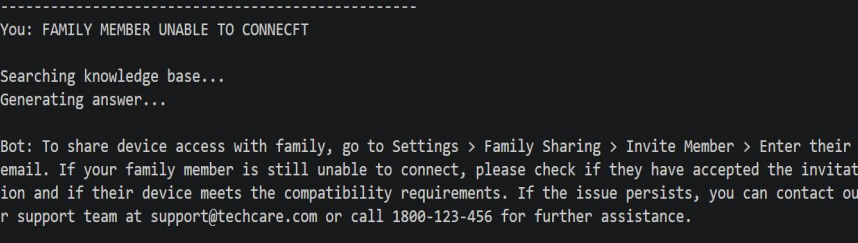
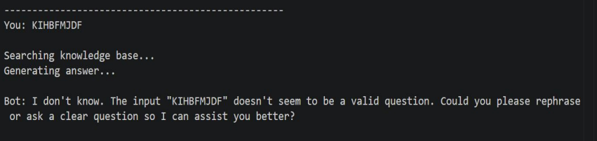

# Output Screenshots

This section presents the execution outputs of the **RAG-Based Customer Support AI Assistant Using LangGraph**. The screenshots demonstrate the system's ability to retrieve information from the knowledge base and generate context-aware responses using the RAG (Retrieval-Augmented Generation) workflow.

---

## 1. System Execution and Output

### Description
This screenshot demonstrates the successful execution of the RAG-Based Customer Support AI Assistant. The user entered the query **"APP IS NOT RESPONDING"** through the command-line interface. The system processed the query using the Retrieval-Augmented Generation (RAG) workflow, retrieved relevant information from the FAISS vector database, and generated a context-aware response using the Groq LLaMA model.

### Features Demonstrated
- User query processing
- Semantic similarity search
- FAISS vector database retrieval
- AI-generated response using Groq LLaMA
- End-to-end RAG workflow execution

---

## 2. Query Response Generation

### Description
This screenshot demonstrates the response generation capability of the RAG-Based Customer Support Assistant. When the user entered the query **"WHAT IS THE SUBSCRIPTION PLAN"**, the system searched the knowledge base, retrieved relevant information from the FAISS vector database, and generated an appropriate response containing subscription plan details and pricing information.

### Features Demonstrated
- Knowledge base retrieval
- Context-aware response generation
- Subscription information lookup
- Natural language response generation
- AI-powered customer assistance

---

## 3. Customer Query Handling

### Description
This screenshot demonstrates how the RAG-Based Customer Support Assistant handles customer-related issues and generates troubleshooting responses. When the user entered the query **"FAMILY MEMBER UNABLE TO CONNECT"**, the system retrieved relevant information and generated step-by-step troubleshooting instructions using the Groq LLaMA model.

### Features Demonstrated
- Customer issue resolution
- Troubleshooting guidance
- Knowledge retrieval from vector database
- Context-aware support response
- Intelligent customer assistance

---

## 4. Invalid Query Handling

### Description
This screenshot demonstrates the system's ability to handle invalid or unclear user queries. When the random text **"KIHBFMJDF"** was entered, the system could not identify any meaningful context from the knowledge base. Instead of generating incorrect information, it produced a fallback response requesting the user to rephrase the query.

### Features Demonstrated
- Invalid query detection
- Query validation
- Fallback response generation
- User-friendly error handling
- Robust AI interaction

---

# Summary

The output screenshots demonstrate the successful implementation of a **RAG-Based Customer Support AI Assistant** using:

- LangGraph
- LangChain
- FAISS Vector Database
- FastAPI
- Groq LLaMA Model
- Retrieval-Augmented Generation (RAG)

The system effectively performs:
- Semantic document retrieval
- Context-aware response generation
- Customer support query resolution
- Subscription information retrieval
- Troubleshooting assistance
- Invalid query handling

These outputs validate the successful integration of modern Generative AI technologies for building an intelligent customer support solution.
